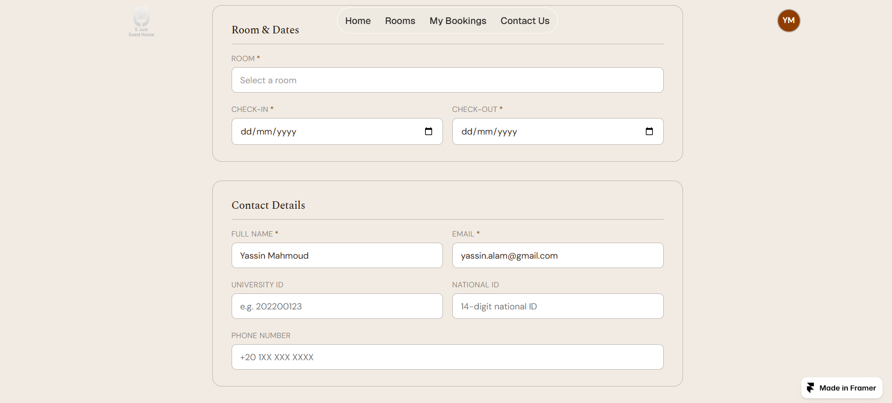
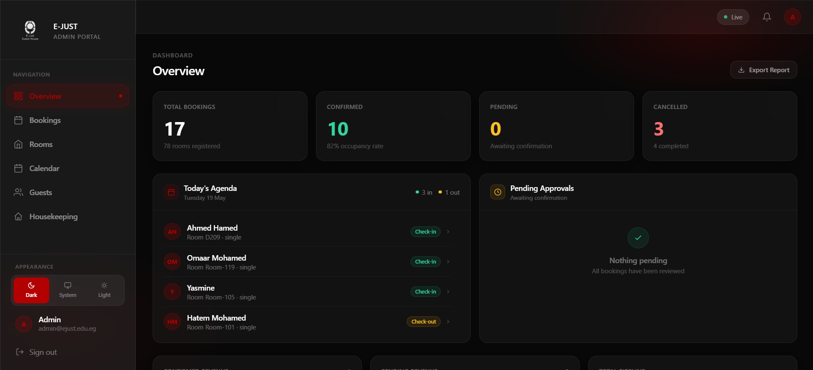
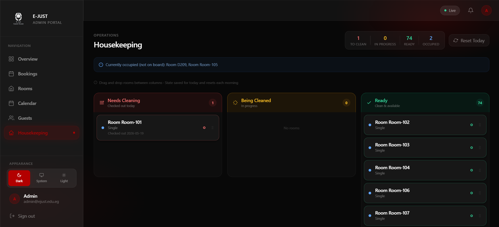
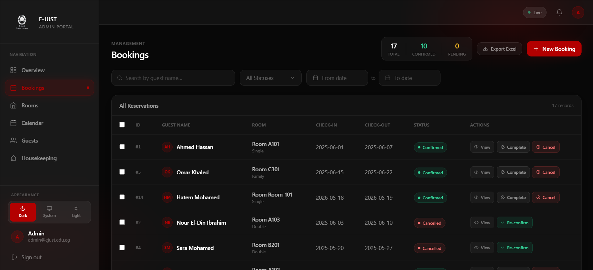

# E-JUST Guest Housing Booking System

> CSE323 Software Engineering — E-JUST, 2026

A fully deployed web platform that replaces E-JUST's phone-based room reservation process.
Students, staff, and external guests browse rooms, create bookings, and pay online.
Administrators manage inventory and approve bookings through a dedicated dashboard.

**Backend:** Railway (FastAPI + PostgreSQL via Supabase) | **Frontend:** Vercel (React + TypeScript)

---

## Project Status

| Phase | Scope | Status |
|---|---|---|
| Phase 1 — Requirements | Actor classification, FR/NFR, edge cases, traceability heatmap | Done |
| Phase 2 — Design | Gherkin BDD, UML SSDs, activity diagrams, API contracts | Done |
| Phase 3 — TDD Implementation | Vertical slices, BookingService, PaymobService, admin API | Done |
| Phase 4 — Validation & Pipeline | 53 integration tests, 20 Playwright E2E, live Supabase | Done |

---

## Screenshots

### Home


### Login


### Room Listing


### Booking Flow


### Admin Dashboard




---

## Tech Stack

| Layer | Technology | Notes |
|---|---|---|
| Frontend | React 18 + TypeScript + Tailwind CSS | Admin dashboard; Vite build; deployed on Vercel |
| API Layer | FastAPI + Pydantic v2 | Async route handlers; Swagger UI at `/api/docs` |
| Service Layer | Python 3.11 | BookingService, AuthService, PaymobService, AdminService |
| Repository Layer | SQLAlchemy 2.x async + asyncpg | All SQL isolated here; SELECT FOR UPDATE concurrency |
| Database | Supabase — PostgreSQL 15 | GiST ExcludeConstraint; B-Tree + partial indexes |
| Auth (Frontend) | Firebase Authentication | Google/Email sign-in; issues ID tokens |
| Auth (Backend) | python-jose (JWT) + argon2-cffi | Argon2id password hashing; HTTPBearer on admin routes |
| Payment | Paymob Intention API v1 | SHA-512 HMAC webhook verification |
| Real-time | FastAPI WebSocket + ConnectionManager | Room availability broadcast on every booking/cancel |
| Hosting | Railway (backend) + Supabase (DB) | Auto-deploys from `main` via GitHub CI |
| Containerisation | Docker multi-stage + docker-compose + Makefile | Dev: hot-reload; Production: 4 uvicorn workers |

---

## Architecture

```
Browser / Admin Dashboard
        │
        ▼
┌───────────────────┐
│   FastAPI (API)   │  HTTP + WebSocket — routing, JWT extraction, error serialisation
└────────┬──────────┘
         │
         ▼
┌───────────────────┐
│  Service Layer    │  BookingService · AuthService · PaymobService · AdminService
│  (business logic) │  overlap check · state machine · HMAC · cost calculation
└────────┬──────────┘
         │
         ▼
┌───────────────────┐
│ Repository Layer  │  SQLAlchemy 2.x async — all SQL lives here
│  UserRepo         │  SELECT FOR UPDATE row-level lock
│  RoomRepo         │  flush but never commit (service commits)
│  BookingRepo      │
└────────┬──────────┘
         │
         ▼
┌───────────────────┐
│  Supabase (PG 15) │  GiST ExcludeConstraint · B-Tree indexes · partial indexes
└───────────────────┘
```

No business logic in the API layer. No HTTP code in the service layer. No SQL in the service layer.

---

## Repository Structure

```
Hotel-Booking-System/
├── backend/
│   ├── app/
│   │   ├── api/v1/          # Route handlers (auth, rooms, bookings, admin, payments, ws)
│   │   ├── core/            # Config, DB engine, exceptions, security
│   │   ├── models/          # SQLAlchemy 2.x ORM models (User, Room, Booking)
│   │   ├── repositories/    # UserRepo, RoomRepo, BookingRepo — all SQL here
│   │   ├── schemas/         # Pydantic v2 DTOs (request/response)
│   │   └── services/        # BookingService, AuthService, PaymobService, AdminService
│   ├── alembic/             # DB migration versions
│   └── tests/
│       ├── unit/            # 29 unit tests (no DB required)
│       └── integration/     # 53 integration tests against live Supabase
├── web-app/                 # React + TypeScript admin dashboard (Vite)
├── tests/                   # Playwright E2E test suite (20 tests)
├── features/                # Gherkin BDD feature files
├── api-contracts/           # TypeScript API contract definitions
├── docs/                    # Architecture, design, requirements, validation docs
├── docker-compose.yml
├── Dockerfile
├── Makefile
└── playwright.config.ts
```

---

## Quick Start

### Prerequisites

- Python 3.11+
- Docker + Docker Compose (recommended)
- Node 18+ (for frontend or E2E tests)

### Option A — Docker (recommended)

```bash
cp .env.example .env
# Set DATABASE_URL, SECRET_KEY, FIREBASE_PROJECT_ID, PAYMOB_SECRET in .env
make up
```

Backend available at `http://localhost:8000` | Swagger UI at `http://localhost:8000/api/docs`

### Option B — Local Python

```bash
cd backend
python -m venv venv && source venv/bin/activate   # or venv\Scripts\activate on Windows
pip install -r requirements.txt
cp ../.env.example .env  # fill in DATABASE_URL and SECRET_KEY
alembic upgrade head
uvicorn app.main:app --reload --port 8000
```

### Seeded Credentials

```
Admin: admin@ejust.edu.eg / Admin123!
```

---

## API Reference

Base URL (production): `https://<app>.railway.app/api/v1`
Auth header: `Authorization: Bearer <JWT>`

| Method | Path | Auth | Status | Description |
|---|---|---|---|---|
| POST | `/api/v1/auth/register` | No | 201 | Register; returns JWT + user object |
| POST | `/api/v1/auth/login` | No | 200 | Authenticate; returns JWT (86 400 s) |
| GET | `/api/v1/rooms/` | Yes | 200 | List all rooms with availability status |
| GET | `/api/v1/rooms/{room_id}` | Yes | 200 | Room detail — amenities, description, price |
| POST | `/api/v1/bookings/` | Yes | 201 | Create booking (starts as `pending`) |
| GET | `/api/v1/bookings/me` | Yes | 200 | Authenticated user's booking history |
| DELETE | `/api/v1/bookings/{id}` | Yes | 204 | Cancel booking (status → `cancelled`) |
| GET | `/api/v1/admin/bookings` | Admin | 200 | All bookings across all users (paginated) |
| PATCH | `/api/v1/admin/bookings/{id}` | Admin | 200 | Update booking status via state machine |
| POST | `/api/v1/admin/rooms` | Admin | 201 | Create new room record |
| POST | `/api/v1/admin/bookings/manual` | Admin | 201 | Manual booking on behalf of named guest |
| POST | `/api/payments/checkout` | Yes | 200 | Paymob Intention — returns `client_secret` |
| POST | `/api/payments/webhook` | Public | 200 | HMAC-verified webhook; updates booking status |
| WS | `/ws/availability` | — | — | Live room availability stream |

Full interactive docs: `GET /api/docs` (Swagger UI) · `GET /api/redoc` (ReDoc)

---

## Booking State Machine

```
pending ──► confirmed ──► cancelled
   │                         ▲
   ├──► rejected ────────────┘
   │
   └──► cancelled
```

Transitions are guarded by `_ALLOWED_TRANSITIONS` in `AdminService`.
`cancelled` is terminal — no out-edges. Enforced in code; GiST ExcludeConstraint enforced at DB level.

---

## Testing

| Level | Tool | Count | Scope |
|---|---|---|---|
| Unit | pytest + pytest-asyncio + respx | **29 / 29** | Overlap algo, Pydantic validators, BookingService, state machine, PaymobService HMAC |
| Integration | pytest + live Supabase | **53 / 53** | Auth, rooms, bookings, admin routes against real DB |
| E2E | Playwright + Page Object Model | **20 / 20** | auth.spec (8) · booking.spec (7) · history.spec (5) — mapped 1:1 to Gherkin |

### Run unit tests

```bash
cd backend
pytest tests/unit/ -v
```

### Run E2E tests

```bash
npx playwright test
# playwright.config.ts auto-starts FastAPI on port 8000
```

### Run integration tests

```bash
# Requires DATABASE_URL pointing to Supabase (or local PG)
cd backend
pytest tests/integration/ -v
```

---

## Key Design Decisions

| Decision | Justification |
|---|---|
| GiST ExcludeConstraint on bookings | Atomic DB-level double-booking prevention even when two transactions pass the app-level overlap check simultaneously |
| SELECT FOR UPDATE in BookingService | Row-level lock acquired before overlap query — first layer of concurrency defence |
| Argon2id password hashing (argon2-cffi) | Memory-hard; replaces bcrypt/passlib which is incompatible with Python 3.14+ |
| Soft deletes (`is_active=False`) | Users and rooms are never physically removed; preserves booking history integrity |
| All secrets via environment variables | `DATABASE_URL`, `SECRET_KEY`, `PAYMOB_SECRET` loaded at runtime; `.env` excluded from git |
| Stateless JWT auth | No server-side sessions; any Railway instance can serve any request — horizontally scalable |

---

## Known Limitations

| ID | Item | Detail |
|---|---|---|
| L-1 | Paymob KYC pending | Integration ID 5596705 returns 404 — not a code bug; API keys accepted. Demo mode active. All 5 PaymobService unit tests pass via respx mocks. |
| L-2 | WebSocket JWT guard | `/ws/availability` accepts unauthenticated connections. Planned: token query-param validation on WS upgrade handshake. |
| L-3 | No request logging | No access-log middleware in production. Planned: structlog integration in `main.py`. |

---

## Team

| Name | Student ID | Vertical Slice | Key Deliverables |
|---|---|---|---|
| Moamen Ahmed Fouad | 120230151 | Infrastructure & Payment | SQLAlchemy models, AuthService, BookingService, Alembic migrations, Paymob Intention API + HMAC webhook, Supabase live connection, Railway CI/CD, 53 integration tests |
| Nour Atef | 120230032 | DevOps & Repository Layer | Docker multi-stage Dockerfile, docker-compose, Makefile, Railway config, UserRepo / RoomRepo / BookingRepo, Firebase Auth integration, pytest infrastructure, staff portal |
| Yassin Mahmoud Alam | 120230122 | Frontend Lead & Project Integrator | Admin dashboard pages (Guests, Housekeeping, Rooms), booking detail modal, Excel export, initial DB schema, auth service wiring, merged 6+ feature branches into master |
| Mohammed ElGendy | 120230154 | QA Engineer & Admin API Backend | Async admin router, admin repository, Pydantic DTOs, HTTPBearer/JWT security, Playwright E2E tests, Postman collection, BDD setup, QA report (8 bugs found) |
| Joudi Sameh | 120230148 | Navigation & Screens | App routing, React Navigation, screen layouts |
