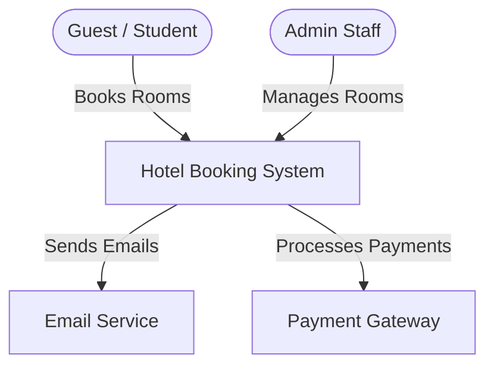
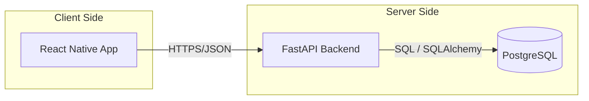

# System Architecture - University Guest Housing Booking System

This document provides a detailed overview of the technical architecture, component interactions, and data flow of the Hotel Booking System.

---

## 1. System Context
The high-level view of how users interact with the system and its external dependencies.

---

## 2. Container Diagram
The system is divided into three primary containers: a Mobile Frontend, a RESTful Backend, and a Relational Database.

---

## 3. Backend Architecture (Layered)
The backend follows a strict layered architecture to ensure separation of concerns and testability.

### Layers Breakdown:
1.  **API Layer (`app/api`)**: 
    - Handles HTTP routing and request parsing.
    - Uses **Pydantic** schemas for request/response validation.
    - Decouples external API models from internal database models.
2.  **Service Layer (`app/services`)**:
    - Contains core **Business Logic**.
    - Orchestrates data flow between repositories.
    - Examples: Room availability checks, booking conflict resolution.
3.  **Repository Layer (`app/repositories`)**:
    - Encapsulates all data access logic.
    - Isolates the database technology from the business logic.
4.  **Database Layer (`app/models`)**:
    - Defines **SQLAlchemy** entities.
    - Represents the physical database schema.

---

## 4. Frontend Architecture (React Native)
The mobile application is structured for scalability and reusability.

-   **Screens**: High-level views (e.g., `HomeScreen`, `BookingScreen`).
-   **Components**: Atomic UI elements (e.g., `RoomCard`, `CustomButton`).
-   **Services**: API client wrappers that communicate with the FastAPI backend.
-   **Navigation**: Managed via **React Navigation** (Stack and Tab navigators).
-   **Hooks**: Custom logic for state management and side effects.

---

## 5. Data Flow Example: Creating a Booking
1.  **User Action**: User clicks "Book Now" on the Mobile App.
2.  **Frontend**: `bookingService.create()` sends a POST request to `/api/bookings`.
3.  **API Layer**: FastAPI receives the request, validates the Pydantic schema, and extracts the User ID from the JWT token.
4.  **Service Layer**: `bookingService.process_booking()` checks if the room is available for the selected dates.
5.  **Repository Layer**: `bookingRepository.add()` saves the new booking record.
6.  **Response**: The API returns a `201 Created` status with the booking details.

---

## 6. Technology Stack
-   **Frontend**: React Native, TypeScript, Expo.
-   **Backend**: Python 3.11+, FastAPI, Pydantic.
-   **Database**: PostgreSQL, SQLAlchemy, Alembic (Migrations).
-   **Infrastructure**: Docker, Nginx (Proposed).
-   **Testing**: Pytest (Backend), Jest (Frontend), Gherkin (BDD).
