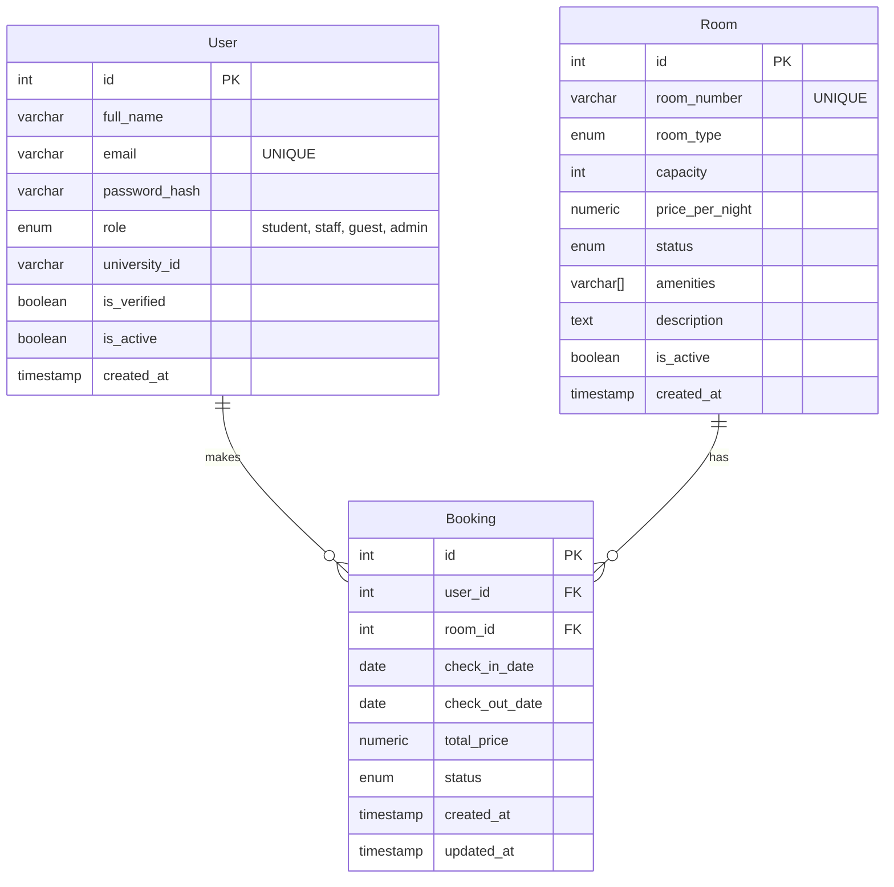

# Database Architecture & Logic

## Overview
This document outlines the core database architecture for the Hotel Booking System, designed to seamlessly handle 5000+ users. The fundamental RDBMS chosen is **PostgreSQL**, leveraging its powerful concurrency control, indexing, and range types.

## Entity Relationship Diagram (ERD)

## Scaling Strategy for 5000+ Users

### 1. Connection Pooling
We utilize **SQLAlchemy Async engine (asyncpg)** with production-grade connection pooling:
- `pool_size`: Allows sustained concurrent connections up to a baseline volume.
- `max_overflow`: Handles short bursts of high traffic.
By using an async driver, FastAPI can handle thousands of concurrent I/O bounds requests without thread-locking.

### 2. Indexing Strategy
To ensure query parsing remains sub-millisecond as tables grow:
- **B-Tree Indexes**: Applied to `user.email`, `room.room_number`, and `booking.status` for O(log n) lookups.
- **Partial Indexes**: For frequently scoped queries (e.g., retrieving only `available` rooms or `active` users) to keep the index payload minimal.

### 3. Collision Detection & Concurrency (Project Defense Highlight)
A common race condition in booking systems is a "double-booking", where two users book the same room for overlapping dates simultaneously.
Instead of relying purely on application-level locks (which fail across multiple pod instances), we enforce this at the database level using **PostgreSQL GiST Exclusion Constraints** on the `DateRange (check_in_date, check_out_date)`. 
The DB atomically rejects any payload that attempts to insert overlapping dates for the exact same `room_id`.
